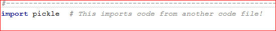

Kopila Bhattarai  
11/20/2019  
IT FDN 100A  
Assignment 7 

Exception-Handling and Pickling in Python
===

Introduction
== 

This unit of the course asks us to do our own research on exception-handling and pickling. We are then supposed to implement our knowledge and come up with examples to explain the topics. Once we are able to write our own code on exception-handling and pickling.

Exceptions-Handling
==  

Exceptions are errors that occur during the execution of the program. If the exceptions are not handled correctly, they could cause the program to terminate. Thus, it is better if we are to be able to foresee possible errors that could occur during the execution of the program.  

A try-except block is used in Python for handling errors. I would like to demonstrate this using the code that I have written as a part of my assignment.  The program below asks the user-input of ID, First Name and Last Name. We want the ID to be a numeric value. If the user enters a non-numeric value, the program generates a message that asks the user to “Please enter ID as integer number. This is because of the try-except block that was used in the program. Had there not been this try-except block, there would have been a generic error message. Figure 2 shows the error message that was generated when a non-numeric ID value was entered.  As we can see the first error-message is much easier for an average user to understand.  

Figure 1: Error message generated by a Try-Catch block code to handle exceptions on user-entered values  

   
Figure 2: A generic error message when a non-numeric value is entered when the user was supposed to enter a numeric value  
    
Similarly, in another try-except code-block, the code asks user to type a file name to read the data from. If the user enters a file-name that does not end with .dat then an easier to understand message is generated as shown in figure 4.

  
Figure 3: A try-catch block to handle exceptions on user-entered values  

  
Figure 4: An easier-to understand error message generated by try-catch block for structured error handling  

If there was no try catch block of error handling code in my program, there would have been a generic File not found error message that would have been generated by the program.  
 
  
Figure 5: Generic file not found error- message generated by a code withoug try-catch block for structured error handling.  

The error message in figure 3 is easier to understand compared to the error message in figure 4.  

Pickling  
==

Pickling is used to serialize and de-serialize objects in Python. It is Python’s way to convert an object into characters stream which can be stored on a disk or sent over a network. This character-stream can later be retrieved or ‘de-serialized’ back to Python object. Pickling is particularly useful in applications where we want data-persistency such as storing objects in a database or transferring information over the TCP socket connection. Pickling is very useful on machine learning algorithms, where data objects need to be saved for future predictions. One word of caution that I almost invariably came across all the resources was to be careful while unpickling data from unknown source as it could be malicious.  

Pickling Files
==

In order to pickle files, first I imported Pickle library to use pickle. I will use my code snippet as an example on
how to pickle objects to file and unpickle back.  

  
Figure 6: Importing pickle library so data can be pickled  

Then I created a file handle and an empty list. We will be using this in the program later. Then I
wrote code to save the file. The ‘wb’ in objFile handle object stands for ‘write’ and ‘binary’.
Basically, these will overwrite existing file and the file will be saved as a binary file. I then used
pickle.dump() function. This function is used to store the object date to file. I used two
arguments: inv_data and objFile. The first argument is the object that I want to store
and the second argument is the file object that I would get by opening desired file in writebinary
(wb) mode. In order to unpickle my object data, I need to use pickle.load() function. The
argument that is inside pickle.load function is the object that I would get by opening the file in
read-binary (rb) mode.  

  
Figure 7: Pickling and unpickling objects  

Python Script
==

In this section, I will demonstrate that my code worked both in PyCharm as well as in command
shell.  
  
Figure 8: Working script in PyCharm  

The script works in command window as well.  
  
Figure 9: Working script in command window  

There are two pickled files that are in the relative folder that is used in this code.  

Figure 10: Files that are in the same relative folder  

When these pickled files are opened in Notepad, they are just a bunch of character streams. They
do not make complete sense. We need to unpickle them in Python.  

  
Figure 11: Pickled data file in Notepad  
 

Helpful Resources  
==  

In my research process to do this assignment, I found the following websites that I feel did good
job of explaining the concepts. I particularly liked that even though they explained the concepts
really well, they are still short and to the point.

Resources for Exception-Handling: 
===

https://stackabuse.com/python-exception-handling/  

This is a link for information on error handling I like this source because the topics are short and
explanations are to the point. This link can serve as a very quick reference for beginner or
refresher for someone who needs it.  

https://realpython.com/python-exceptions/  

This is another source for error handling that I liked. I liked this one because the brevity as well
as how nicely formatted the information is. For someone like me who is a visual learner, I think
this will help get the point across very quickly.  

Resources for Pickling in Python:  
===  

https://www.geeksforgeeks.org/understanding-python-pickling-example/  

I like the clear description of Pickling in this source. It is short and to the point.  

https://stackoverflow.com/questions/7501947/understanding-pickling-in-python  

I like this source because it gives you an idea of problems other “Picklers” are facing and their
possible solutions. This is helpful because you might come across similar situation when you are
pickling.  

Summary  
==  

In this assignment I did my research to learn more about error handling and pickling
objects in Python. I then wrote a code-script that would use some error-handling as well as
pickling and unpickling of objects.
I felt pretty comfortable about error-handling pretty quick. However, the learning curve
for pickling and unpickling of objects in Python was very steep. It took quite a lot of reading for
me to wrap my head around the concept. But once I was able to understand it, it suddenly started
feeling as obvious as ‘locking’ and ‘unlocking’ of objects. Overall, it was a very good learning experience. 
